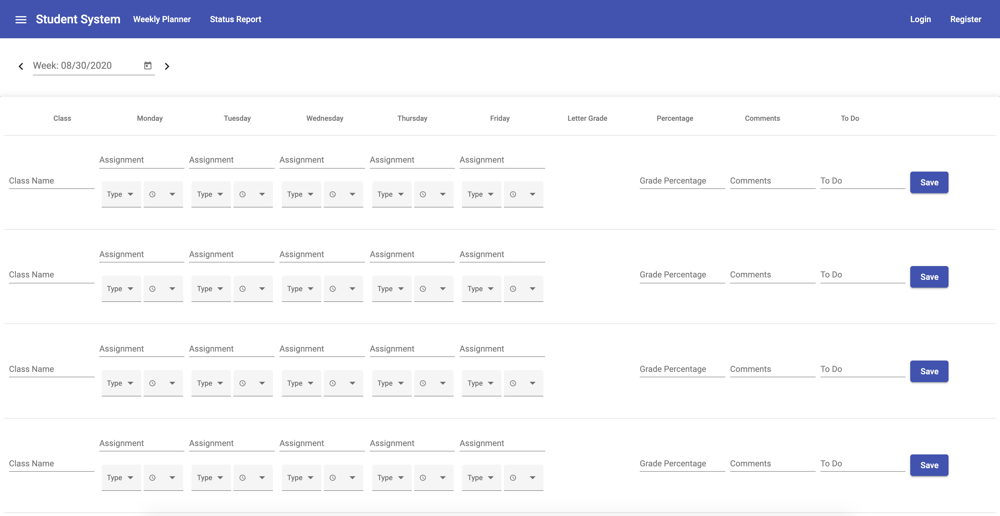

# StudentManagementSystem

This system is meant for use to track students' 1) weekly assignments 2) general progress throughout the school year.

### Weekly Planner:

This planner is meant to help students track their assignments week to week. It requires student input every week.

The planner can keep track of:

- day to day assignments
- progress on each assignment
- overall grade percentage in each class
- comments and todo's with regards to each class

Below are screenshots of the planner in a very early stage:

Unedited Planner

Filled Out Planner

### Status Report:

The Status Report is meant as a tool for students, parents, and tutors. It gives a high level overview of how the student has been performing over the semester / school year. Visual displays such as charts and graphs will be provided.

# Implementation

### Backend

The backend server is written in Node.js

### Frontend

The frontend was created using Angular.

# Installation

# Usage
